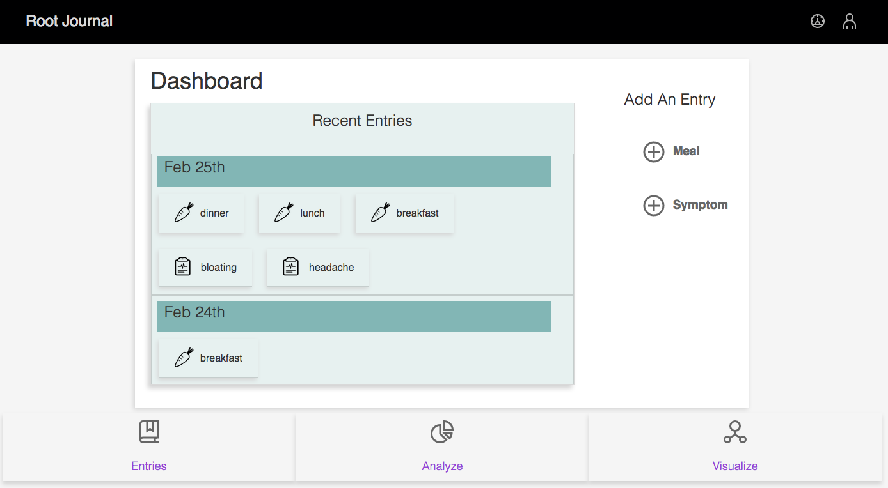

# README

Welcome to Root Journal!
A simple to use food journaling app that helps you troubleshoot food sensitivities. Root Journal is designed to focus on quality over quantity and can be integrated with health coaches, doctors and nutritionists. You won't find any nutrition facts here, just a focus on real food and how you're feeling.

Here's what you can expect when using Root Journal:

* Track your eating habits, send out daily, weekly or monthly updates to your practitioner.
* Have a headache? Easily track it and then see if there's a correlation with what you're consuming.
* Put the notebook down and easily log your your meals, Root Journal does the hard part for you and gives you clues to find your own root cause.

* Ruby/Rails version:
    2.3.4/5.1.4
* React Version:
    16.1.1
* System dependencies:
    Grommet, Moment, Redux, Thunk +more
* Configuration:
    You may need to run `npm install grommet-css --save` to properly link the css
* Database creation:
    Postgresql: `rails db:create`
* Database initialization:
    `rails db:migrate`
* Deployment instructions:
    `rake start` opens client localhost:3000 and API on localhost:3001
